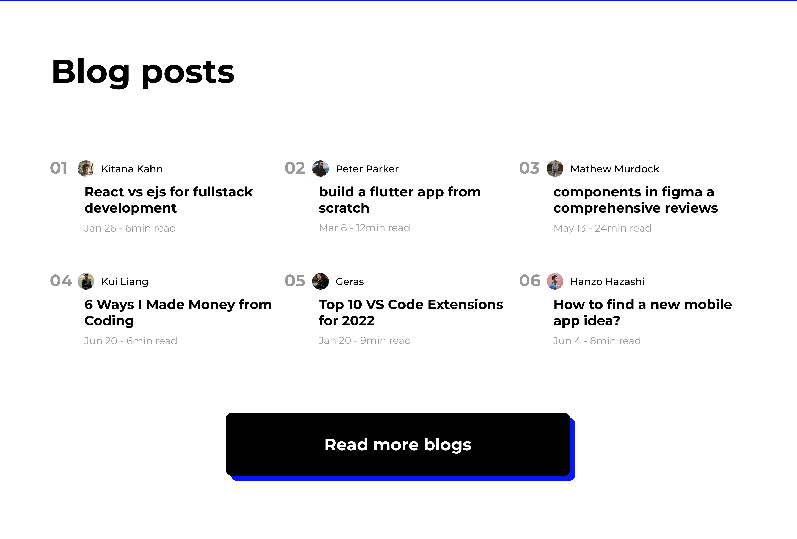
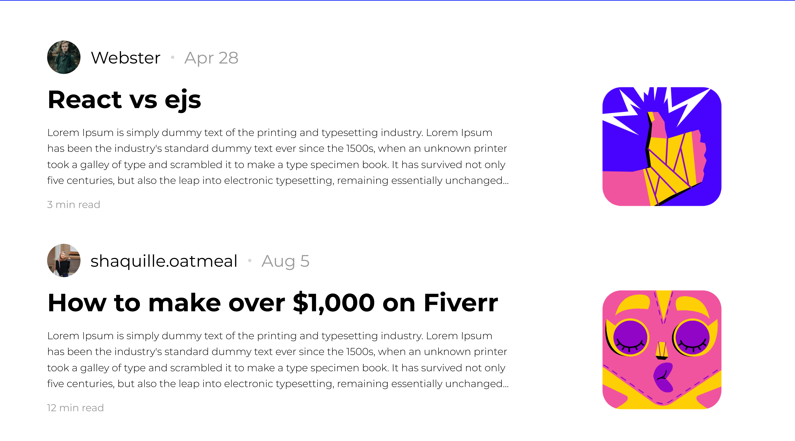

# Bloggz

Bloggz is a fullstack blog website built with MERN stack

# Installation guide

## dependencies

1. Express
2. body parser
3. mongoose
4. react
5. react router

## Development Environment

- node

To install backend dependecies run the below command

```jsx
cd backend

//then

npm install
```

to install react and other frontend dependencies run the below command

```jsx
cd frontend

// then

npm install
```

# Sneak Peak 👁

## Home page design


## Blog page designs






## Blog post compose page

